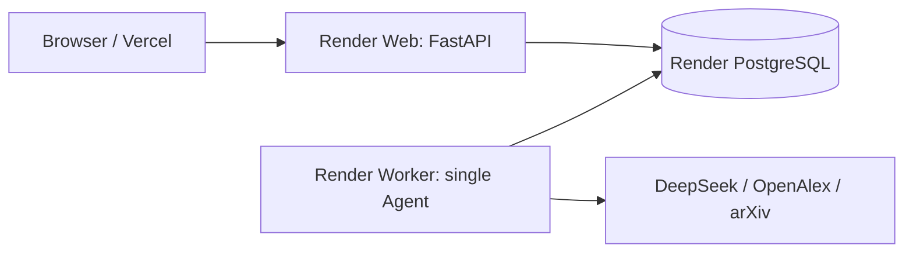

# PaperTrace Agent 部署指南

生产拓扑：



`render.yaml` 使用以下资源：

- `papertrace-api`：Free Web Service，只处理 HTTP。
- `papertrace-agent-worker`：Starter Background Worker，串行处理 Run。
- `papertrace-db`：Basic PostgreSQL，持久化领域数据和 Agent Trace。

Background Worker 不支持 Render Free 实例，当前 Blueprint 会产生费用。资源类型和可用 plan 以 [Render Blueprint 文档](https://render.com/docs/blueprint-spec) 为准。

## 1. 部署前检查

```powershell
git status --short
python -m pytest backend/tests -v

cd backend
python -m evals.runner --suite smoke
python -m evals.runner --suite relations
python -m alembic upgrade head

cd ..\frontend
npm ci
npm run build
```

确认仓库中没有 `.env`、数据库文件或真实 API Key。

## 2. Render Blueprint

1. 在 Render 创建 Blueprint，选择 PaperTrace GitHub 仓库。
2. Render 自动读取仓库根目录的 `render.yaml`。
3. 同步前确认 Worker 与 PostgreSQL 的付费 plan。
4. 为 Web 和 Worker 分别填写 `DEEPSEEK_API_KEY`。
5. 为 Web 填写 `FRONTEND_ORIGIN`，先可使用临时 Vercel URL，之后再更新。
6. 执行 Blueprint Sync。

Web 启动命令会先执行：

```bash
alembic upgrade head
```

迁移成功后才启动 Uvicorn。Worker 最多等待 120 秒让 schema 就绪，然后开始轮询 `agent_runs`。生产环境两个服务都设置 `AGENT_EMBEDDED_WORKER=false`，因此只有一个独立 Worker 消费任务。

验证：

```text
GET https://<papertrace-api>.onrender.com/
GET https://<papertrace-api>.onrender.com/docs
```

根接口应返回 `status: ok`，并显示 `embedded_worker: false`。

## 3. Vercel 前端

1. 在 Vercel 导入同一仓库。
2. Root Directory 设置为 `frontend`。
3. Framework Preset 选择 Next.js。
4. 添加环境变量：

```text
NEXT_PUBLIC_API_URL=https://<papertrace-api>.onrender.com
```

5. 部署前端。
6. 回到 Render，把 Web 的 `FRONTEND_ORIGIN` 更新为完整 Vercel HTTPS 域名。
7. 如果有多个前端域名，用英文逗号分隔。

## 4. 数据库迁移

### 全新数据库

```bash
cd backend
alembic upgrade head
alembic current
```

### 已有旧版 SQLite / PostgreSQL

旧版数据库由 `Base.metadata.create_all()` 创建，没有 `alembic_version`。先备份，再使用当前代码补齐 Agent 表并建立 baseline：

```bash
cd backend
python -c "from database import init_db; init_db()"
alembic stamp 20260715_0001
alembic current
```

只对确认包含当前全部表的旧数据库执行 `stamp`。不要在生产环境执行初始迁移的 `downgrade`，因为它会删除领域表和 Agent 表。

### 创建后续迁移

```bash
cd backend
alembic revision --autogenerate -m "describe change"
alembic upgrade head
python -m pytest tests/test_migrations.py -v
```

提交前必须检查自动生成的 upgrade 和 downgrade 内容。

## 5. GitHub Actions

`.github/workflows/ci.yml` 包含两个 Job：

- Backend：安装依赖、运行全部 pytest、Smoke Eval、Relation Eval 和 `compileall`。
- Frontend：执行 `npm ci`、依赖安全审计、ESLint 与 `npm run build`。

Eval 的 JSON 和 Markdown 报告会作为 `agent-eval-reports` Artifact 上传。CI 使用确定性 Fake Runtime，不消耗 DeepSeek 配额。

## 6. 生产验收

1. `POST /api/agent/runs` 创建 Run，响应状态应为 `queued`。
2. `GET /api/agent/runs/{id}` 应从 `queued` 进入 `running`。
3. `GET /api/agent/runs/{id}/events?after_seq=0` 应返回递增 sequence。
4. `GET /api/agent/runs/{id}/trace` 应显示 Step 与 ToolCall。
5. 完成后 `/result` 应包含 papers、claims、matrix、review、recommendations 和 verification。
6. 重启 Worker，已完成 Artifact 不应重复执行；运行中的 Run 应重新排队恢复。
7. 创建测试 Run 后验证 cancel；构造失败 Run 后验证 retry。

## 7. 运维边界

- 当前只有一个 Worker，不做多线程或分布式并发调度。
- PostgreSQL 同时承担 Run Store 和轻量任务队列，不额外引入 Redis。
- 取消在 Step 边界生效，不会强杀正在进行的外部 HTTP 请求。
- Worker 退出时 Render 最多等待 120 秒，仍应避免一次工具调用超过平台限制。
- 定期备份 PostgreSQL；Agent Trace 中不要写入密钥、完整提示词机密或隐藏思维链。

## 8. 常见故障

| 现象 | 检查项 |
| --- | --- |
| Web 启动失败 | Render 日志中的 Alembic 错误与 `DATABASE_URL` |
| Worker 超时退出 | Web 是否完成迁移、数据库是否可连接 |
| Run 一直 queued | Worker 是否 Live、两个服务是否连接同一数据库 |
| DeepSeek 401/402 | 两个服务的 API Key 和账户余额 |
| 浏览器 CORS | `FRONTEND_ORIGIN` 是否为完整 HTTPS 域名且无尾斜杠 |
| Eval 失败 | 下载 `agent-eval-reports` 查看 case 指标 |
| 前端 404/网络错误 | `NEXT_PUBLIC_API_URL` 是否指向 Render Web |

Render 推荐使用 pre-deploy command 执行迁移，但该能力受服务 plan 约束；当前 Web 是 Free plan，所以 Blueprint 将迁移放在 Web start command 中。相关限制见 [Render Deploy 文档](https://render.com/docs/deploys#deploy-steps)。
