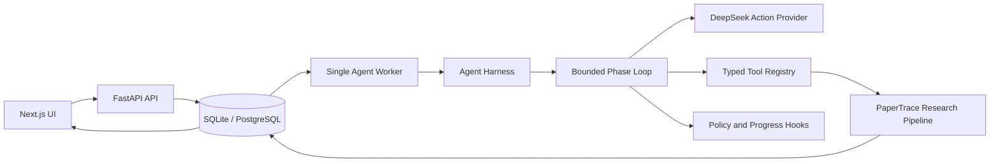

# PaperTrace Agent

PaperTrace 是一个面向学术调研的单 Agent 系统。输入研究问题后，它会检索论文、抽取结构化主张、分析支持与矛盾关系、生成带引用的综述、校验证据，并保留完整执行轨迹。

这版不再使用进程内任务字典和 `BackgroundTasks`。Run、Step、ToolCall、Artifact 与 Event 都持久化到数据库，服务重启后可以从已完成的 Artifact 继续执行。

## 能做什么

- 从 OpenAlex 检索论文，失败时回退到 arXiv
- 用 DeepSeek 抽取 `subject / intervention / conclusion / direction`
- 构建 `support / contradict / unrelated` 关系矩阵
- 生成时间线、矛盾网络、综述与后续研究建议
- 展示 Agent 当前阶段、动作、工具调用和增量事件
- 支持等待用户输入、取消、失败重试和 checkpoint 恢复
- 导出 Markdown 报告与 BibTeX
- 用离线 Fake Model 和 Fake Tools 做无 API Key 的确定性 Eval

## Agent 架构



### 七阶段状态机

| Phase | 目标 | 允许的工具 | 必需 Artifact |
| --- | --- | --- | --- |
| `PLAN` | 形成研究计划 | `plan_research` | `research_plan` |
| `DISCOVER` | 检索和筛选论文 | `search_papers` | `paper_set` |
| `EXTRACT` | 抽取结构化主张 | `extract_claims` | `claim_set` |
| `ANALYZE` | 判定主张关系 | `classify_relations` | `evidence_graph` |
| `SYNTHESIZE` | 生成综述和建议 | `generate_review`, `recommend_directions` | `review_draft`, `recommendations` |
| `VERIFY` | 检查引用覆盖与证据一致性 | `verify_evidence` | `verification_report` |
| `FINALIZE` | 封装最终结果 | `finalize_report` | `final_report` |

### Loop 范式

每个阶段运行同一个有界循环：

1. 从数据库读取 Run、历史 Step 和 Artifact。
2. `before_step` Hook 检查总步数与阶段步数预算。
3. Model Provider 返回严格类型化动作：`tool`、`complete_phase`、`request_input` 或 `abort`。
4. Policy 校验阶段工具白名单、参数哈希和重复调用次数。
5. Tool Registry 校验输入输出，执行工具并进行一次受控重试。
6. 持久化 Step、ToolCall、Artifact 和 Event。
7. 必需 Artifact 齐全后进入下一阶段，否则把观察结果反馈给下一轮。

默认预算为 20 个总 Step、每阶段 4 个 Step、同参数工具最多调用 2 次、单工具重试 1 次。系统只记录简短 `rationale` 和可观察结果，不请求或存储隐藏思维链。

### Hook 范式

- `BudgetHook`：限制 Step、阶段和工具权限。
- `ProgressHook`：把阶段与动作进度写入 Event 流。
- `PersistenceHook`：为持久化扩展保留统一入口。
- `TraceHook`：为 tracing 和外部可观测平台保留入口。
- `RecoveryHook`：为恢复策略扩展保留入口。

Hook 按 `order` 顺序执行，返回 `allow / reject / pause`。HookContext 是只读 Pydantic 模型，避免 Hook 隐式修改运行状态。

## 持久化模型

领域数据：

- `papers`、`claims`、`contradictions`
- `relation_cache`

Agent Run Store：

- `agent_runs`：状态、当前阶段、预算、输入上下文和错误
- `agent_steps`：模型动作、token、时间与结果
- `agent_tool_calls`：参数哈希、重试、耗时、错误和 Artifact 引用
- `agent_artifacts`：按 `run_id + kind + version` 保存阶段产物
- `agent_events`：按 Run 单调递增的事件序列

Schema 使用 Alembic 管理，生产数据库使用 PostgreSQL，本地默认使用 SQLite。

## 技术栈

| 层 | 技术 |
| --- | --- |
| Agent | Typed actions, phase state machine, bounded loop, hooks, policies |
| Backend | Python 3.11+, FastAPI, Pydantic v2, SQLAlchemy 2, Alembic |
| Model | DeepSeek OpenAI-compatible Chat Completions API |
| Database | SQLite / PostgreSQL 18, psycopg 3 |
| Frontend | Next.js 16, React 19, TypeScript, Tailwind CSS, ECharts |
| Quality | pytest, deterministic offline evals, GitHub Actions |
| Delivery | Render Web + single Worker + PostgreSQL, Vercel frontend |

## API

Agent 原生接口：

| Method | Path | 用途 |
| --- | --- | --- |
| `POST` | `/api/agent/runs` | 创建 Run |
| `GET` | `/api/agent/runs/{id}` | 获取状态和当前阶段 |
| `GET` | `/api/agent/runs/{id}/events?after_seq=N` | 增量事件流 |
| `GET` | `/api/agent/runs/{id}/trace` | Step 与 ToolCall Trace |
| `GET` | `/api/agent/runs/{id}/result` | 获取最终报告 |
| `POST` | `/api/agent/runs/{id}/input` | 提交补充信息并恢复 |
| `POST` | `/api/agent/runs/{id}/cancel` | 取消 Run |
| `POST` | `/api/agent/runs/{id}/retry` | 原 Run 失败重试 |
| `POST` | `/api/agent/runs/{id}/export` | 导出报告 |

兼容接口 `/api/analyze`、`/api/task/{id}`、`/api/result/{id}`、`/api/review/{id}` 和 `/api/export/{id}` 仍可使用，但底层已经全部映射到持久化 Run Store。旧的通用 `/api/chat` 已移除。

## 本地运行

### 后端

```powershell
cd backend
python -m venv .venv
.\.venv\Scripts\Activate.ps1
pip install -r requirements.txt
Copy-Item .env.example .env
# 编辑 .env，填写 DEEPSEEK_API_KEY
python -m alembic upgrade head
uvicorn main:app --reload --port 8000
```

本地默认 `AGENT_EMBEDDED_WORKER=true`，API 进程会启动一个串行 Worker，适合开发和演示。

需要模拟生产拆分时：

```powershell
# Terminal 1
$env:AGENT_EMBEDDED_WORKER="false"
uvicorn main:app --reload --port 8000

# Terminal 2
python -m agent.worker
```

### 前端

```powershell
cd frontend
npm ci
$env:NEXT_PUBLIC_API_URL="http://localhost:8000"
npm run dev
```

打开 `http://localhost:3000`，API 文档位于 `http://localhost:8000/docs`。

## 测试与 Eval

```powershell
# 仓库根目录
python -m pytest backend/tests -v
python -m compileall backend

# backend 目录
cd backend
python -m evals.runner --suite smoke
python -m evals.runner --suite relations

# frontend 目录
cd ..\frontend
npm ci
npm audit --audit-level=high
npm run lint
npm run build
```

离线 Eval 使用真实 Repository、Harness 和 Loop，但替换模型与领域工具，因此不需要 `DEEPSEEK_API_KEY`。报告写入 `backend/evals/reports/*.json` 和 `*.md`，该目录默认不提交生成物。

## 项目结构

```text
backend/
  agent/                 Harness、Loop、Hooks、Policy、Tools、Worker
  alembic/               数据库迁移
  evals/                 数据集、指标、Fake Runtime、报告生成
  tests/                 Repository、Runtime、Tools、API、Eval、Migration 测试
  main.py                Agent API 与兼容接口
  database.py            SQLAlchemy engine 和领域模型
frontend/
  app/result/[taskId]/   Agent 结果页与增量轮询
  components/AgentTrace.tsx
.github/workflows/ci.yml
render.yaml
DEPLOY.md
```

## 部署

完整步骤见 [DEPLOY.md](./DEPLOY.md)。`render.yaml` 会创建一个 Web 服务、一个串行 Background Worker 和一个 PostgreSQL 数据库。Worker 与数据库使用最低生产档，会产生 Render 费用，请在同步 Blueprint 前确认账户计费设置。

## License

仅作教学、研究与赛事演示用途。论文文本、摘要等数据版权归原始作者与出版方所有。
